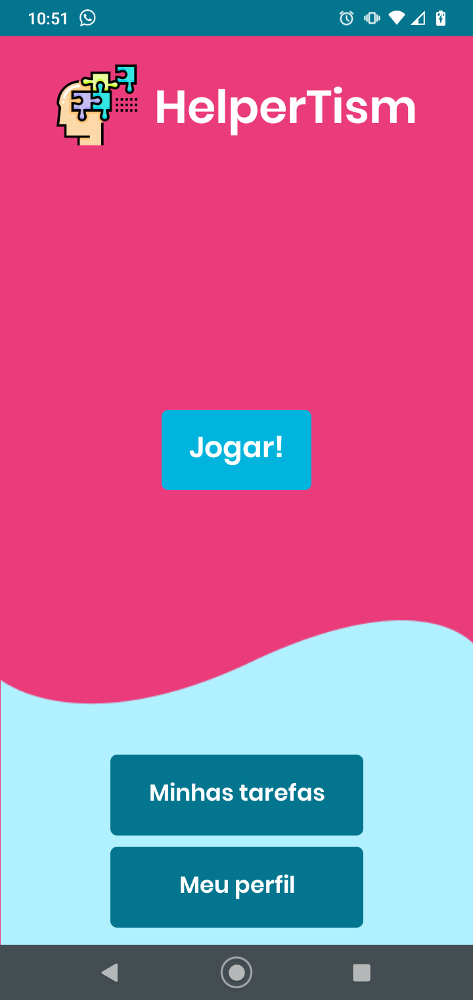
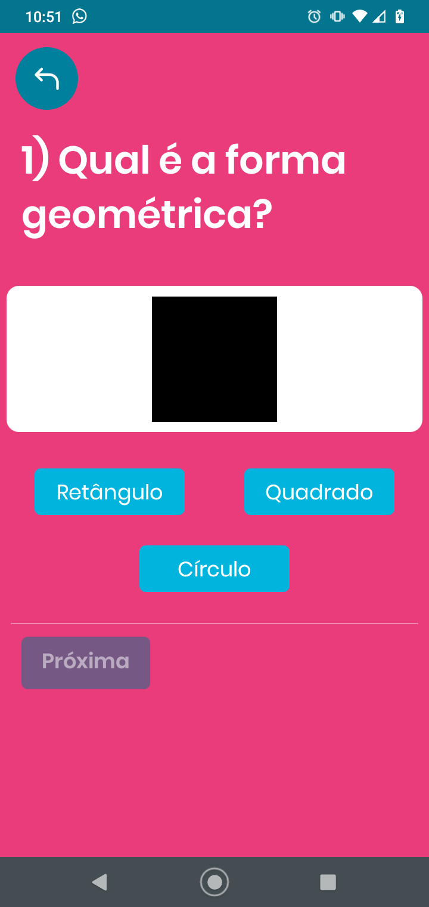
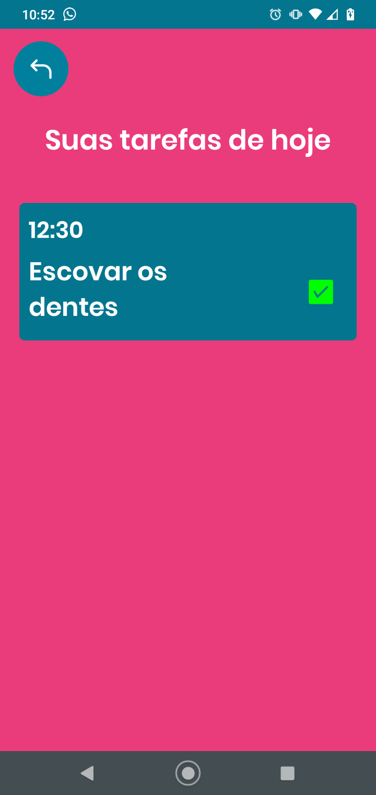

# HelperTism
HelperTism é um aplicativo para dispositivos móveis que tem como principal objetivo auxiliar no ensino-aprendizagem de crianças autistas. 
Desenvolvido com React Native e Firebase. 😄

Imagens do projeto: 

  
  
  
 

 
 Você pode clonar esse projeto com o seguinte comando: git clone https://github.com/zCHICOz/HelperTism.git
